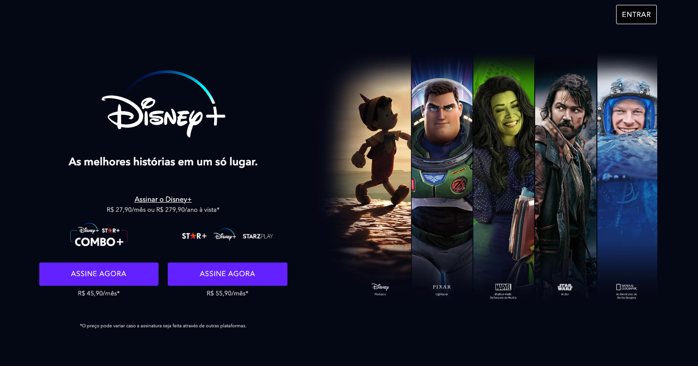

# Disney+ Clone Site

Este site é um clone do site original Disney+, foi desenvolvido em HTML, CSS e JavaScript, oferecendo um design moderno,
agradável e responsivo. Desenvolvimento do projeto focado em perfomance com uso do pré-processador de CSS SASS e Gulp
como automatizador de tarefas, como compilação do SASS e compressão de imagens.

Este projeto foi realizado com a aplicação da Metodologia BEM em toda estrutura do projeto, buscando aplicar as
melhoras práticas de programação para desenvolvimento web.

Projeto desenvolvido no curso de Full Stack Python da EBAC - Escola Britânica de Artes Criativas e Tecnologia.

## 🚀 Começando

Estas instruções permitirão que você obtenha uma cópia do projeto em execução em sua máquina local para fins de
desenvolvimento e teste.

### Pré-requisitos

Antes de começar, certifique-se de ter as seguintes ferramentas instaladas em sua máquina:

- **Node.js**
- **npm (geralmente vem com o Node.js)**
- [VSCode](https://code.visualstudio.com/)
- [Live Server](https://github.com/ritwickdey/vscode-live-server-plus-plus)

### Instalação

Siga estas etapas a seguir para configurar o ambiente de desenvolvimento:

1. Clone este repositório em sua máquina local.
2. Navegue até o diretório clonado.
3. Instale a extensão [Live Server] no VSCode.
4. Com arquivo HTML principal aberto, clique em "Go Live" no canto inferior direito do VSCode para executar o projeto.
3. Execute o seguinte comando para instalar as dependências:

  **``npm install``**

### Executar o projeto

No arquivo package.json, em scripts, é possível designar os comandos desejados para execução do projeto em ambiente de
desenvolvimento e produção.

      "scripts": {
            "dev": "gulp watch",
            "build": "gulp",
      }

Para ambiente de desenvolvimento, utilizamos o comando dev, que foi configurado com o watch para captar as alterações
nos arquivos enquanto codamos:
 
  **``npm run dev``**

Para ambiente de produção, utilizamos o comando build:

  **``npm run build``**

A pasta "dist" será criada com os arquivos minificados para produção.

## 🛠️Ferramentas utilizadas para construção do projeto

* **HTML** - Linguagem de marcação utilizada na construção de páginas na Web.
* **CSS** - Cascading Style Sheets é um mecanismo para adicionar estilos a uma página web.
* **NPM** - Gerenciador de pacotes padrão para o ambiente de tempo de execução JavaScript Node.JS.
* **JavaScript** - Linguagem de programação interpretada estruturada, de alto nível com tipagem dinâmica fraca e multiparadigma.
* **SASS** - Pré-processador CSS, "Syntactically Awesome Style Sheets" é uma linguagem de folhas de estilo.
* **GULP** - Ferramenta de automação de tarefas em JavaScript.
* **Metodologia BEM** - Block Element Modifier, é uma forma de organizar o código CSS para solucionar problemas frequentes no desenvolvimento web.

## ✒️ Autor

Guilherme Ferreira Camargo
